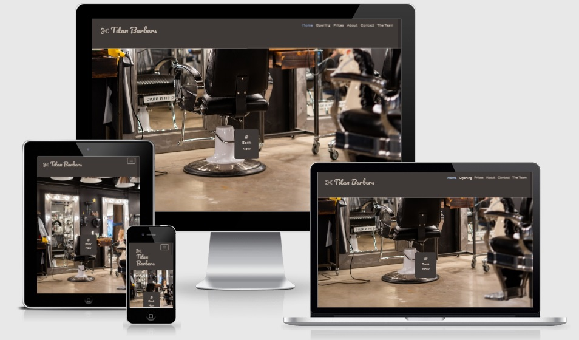
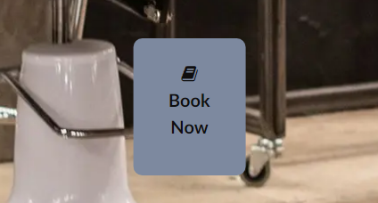

<h1 align="center">Titan Barbers</h1>

## [View The Live Project Here](https://ed-whyatt.github.io/titan-barbers/)

### This website will be the first contact point for a customer browsing the web who will be visiting Titan Barbers. It is designed for the customer to easily navigate using a wide range of devices to find all the information needed to know the opening times, cost, location and contact information of the shop.

## 

## User Experience (UX)

-  #### First Time Customer Goals

    1. As a First Time Customer, I want to easily book an appointment and see the prices for a haircuts or beard trim.
    2. As a First Time Customer, I want to be navigated easily throughout the website to find content
    3. As a First Time Customer, I want to familiarize myself with the staff and see information about their skills and history.

-   #### Returning Customer Goals

    1. As a Returning Customer, I want to easily navigate back to book another appointment.
    2. As a Returning Customer, I want to easily navigate to the address.

-   #### Frequent Customer Goals

    1. As a Frequent Customer, I want to check if any staff have left.
    2. As a Frequent Customer, I want to easily see if there have been any changes to the prices.

### Design

-  ### Colour Scheme

      - The main colours used are Medium brown, Pastel brown, Pastel Blue and Pastel Chalk. 
      - Dark Brown and a lighter Pastel blue are used for contrast in some of the text and form.
      - [Color Mind](http://colormind.io/) : Colormind has been used to aid the desision the colour sceme for the project.
      ### 

-   #### Typography

     -   The main fonts on this site are Lato and Poppins with a fall back font of sans-serif.
     -	 The font of the shop name in the header of this site is Pacifico with a fall back of cursive.

-   #### Imagery

    #### [Pixels](https://www.pexels.com/) : Pixels images have been used to show the interior of the shop and the staff portraits.
    
-  Home page images:

    1. [Book now image](https://www.pexels.com/photo/man-in-black-t-shirt-sitting-on-black-chair-3993133/)
    1. [Abount us sectionn image](https://www.pexels.com/photo/person-in-black-long-sleeve-shirt-holding-gold-and-silver-beaded-bracelet-3998389/)

- Meet the team page images:
    
    1. [Andy image](https://www.pexels.com/photo/cheerful-ethnic-waiter-in-apron-standing-against-street-cafe-5920775/)
    1. [David image](https://www.pexels.com/photo/man-in-black-hat-and-white-dress-shirt-3998422/)
    1. [James image](https://www.pexels.com/photo/a-man-in-a-black-suit-and-a-silver-scissors-mid-air-5337959/)
    1. [John image](https://www.pexels.com/photo/a-man-holding-on-the-armrest-of-a-barber-chair-8867160/)
    1. [Martin image](https://www.pexels.com/photo/a-barber-with-tattoos-8552627/)
    1. [Tim image](https://www.pexels.com/photo/man-people-woman-sitting-7697395/)

## Wireframes

- Home Page Wireframe - [view](documentation/wireframes/home.png)

- Contact Page Wireframe - [view](documentation/wireframes/contact.png)

- Meet The Team Page Wireframe - [view](documentation/wireframes/meet-team.png)

- Mobile Home Page Wireframe - [view](documentation/wireframes/mobile-home.png)

- Mobile Contact Page Wireframe - [view](documentation/wireframes/mobile-contact.png)

- Mobile Meet The Team Page Wireframe - [view](documentation/wireframes/mobile-meet-team.png)

- Tablet Home Page Wireframe - [view](documentation/wireframes/tablet-home.png)

- Tablet Contact Page Wireframe - [view](documentation/wireframes/tablet-contact.png)

- Tablet Meet The Team Page Wireframe - [view](documentation/wireframes/tablet-meet-team.png)

## Features

-   ### Responsive on all devices - [view](documentation/responsive-design/responsive-design-image.jpg)

-  ### Interactive elements.

    - ### Navagation have links to Home, Opening, Prices, About and The team.
      ### 
    
    - ### Book now button witch takes you to the contact page.
      ### 

    - ### Intreactive menu when viewed on a mobile and tablet.
      ### 
    - ### Back to top arrow across all pages.
      ### 
      ### 

-   ### Other Features include:

    - ### Prices section.
      ### 
    - ### Opening hours section.
      ### 
    - ### About Us section.
      ### 
    - ### Contact page with form and contact details.
      ### 
      ### 
    - ### Meet the team page.
      ### 

## Technologies Used

### Languages Used

-   [HTML5](https://en.wikipedia.org/wiki/HTML5)
-   [CSS3](https://en.wikipedia.org/wiki/Cascading_Style_Sheets)

### Frameworks and libraries

1. [Bootstrap 4.4.1:](https://getbootstrap.com/docs/4.4/getting-started/introduction/)
    - Bootstrap was used to assist with the responsiveness and styling of the website.
1. [Google Fonts:](https://fonts.google.com/)
    - Google fonts were used to import the 'Lato', 'Poppins' and 'Pacifico' fonts into the style.css file which is used on all pages throughout the project.
1. [Font Awesome:](https://fontawesome.com/)
    - Font Awesome was used on all pages throughout the website to add icons for aesthetic and UX purposes.
1. [jQuery:](https://jquery.com/)
    - jQuery came with Bootstrap to make the navbar responsive but was also used for the smooth scroll function in JavaScript.
1. [Git](https://git-scm.com/)
    - Git was used for version control by utilizing the Gitpod terminal to commit to Git and Push to GitHub.
1. [GitHub:](https://github.com/)
    - GitHub is used to store the projects code after being pushed from Git.
1. [Balsamiq:](https://balsamiq.com/)
    - Balsamiq was used to create the [wireframes](https://github.com/Ed-Whyatt/titan-barbers/blob/main/README.md) during the design process.
1. [Am I Responsive Design:](http://ami.responsivedesign.is/)
    - Am I Responsive Design was used for the responsive image in Readme.

### GitHub Projects

1. [GitHub Projects](https://github.com/Ed-Whyatt/titan-barbers/projects/1)
1. [GitHub Projects screen shot](/documentation/git-hub-projects/git-hub-projects-barbers.jpg)
    - Git hub projects was used to organise the tasks easily throughout the proses of creating the project.

## Testing

The W3C Markup Validator and W3C CSS Validator Services were used to validate every page of the project to ensure there were no syntax errors in the project.

-   [W3C Markup Validator](https://validator.w3.org/#validate_by_uri) - [Results](/documentation/w3c-validator/w3c-html-checker.jpg)
-   [W3C CSS Validator](https://jigsaw.w3.org/css-validator/#validate_by_input) - [Results](/documentation/w3c-validator/w3c-css-testing.jpg)

## Google DevTools

Google DevTools and Lighthouse has been used for testing and editing the project.

-  [Google DevTools](https://developer.chrome.com/docs/devtools/)

-  ### Fixed Bugs

 Some of the heading eleements were not in sequentially-decending order across the website.
   
-  ### 

### Testing User Stories from User Experience (UX) Section

-  #### First Time Customer Goals

    1. As a First Time Customer, I want to easily book an appointment and see the prices for a haircuts or beard trim.

          1. when entering the site, customers are automatically greeted with an easily readable navigation bar with a clear description to go to the location of there choice. Underneath is an image of the shop with a clear button with book now on it, witch navigates to the contact page.
          2. The shop is shown in the first image with an excellent view of the comfy chairs they could be sitting in for a beard trim or haircut.

    2. As a First Time Customer, I want to be navigated easily throughout the website to find content
          1. The customer has lots of options to easily navigate to the prices and opening hours in the navigation bar. Witch becomes a drop-down menu in mobile and tablet view.
          2. The customer can easily navigate to the top of the page throughout the website.

    3. As a First Time Customer, I want to familiarize myself with the staff and see information about their skills and history.
          1. The customer can see a clear image of each team member so they can familiarize with them when vesting the shop.
          2. The customer can easily navigate to the meet the team page and read a little bit about the staff and their skills.

-   #### Returning Customer Goals

    1. As a Returning Customer, I want to easily navigate back to book another appointment.
           1. The customer can easily navigate to the contact page using the navigation or the book now button.
           2. The customer can find all the information to book another appointment on the contact page.
    
    2. As a Returning Customer, I want to easily navigate to the address.
           1. The customer and esaliy find the address in the contact page and in the footer of all the pages.

-   #### Frequent Customer Goals

    1. As a Frequent Customer, I want to check if any staff have left or there are any new staff.
           1. The customer can easily navigate to the meet the team page where thay can see all the current staff.
           2. The customer can easily see a picture and decription of the staff witch will be updated if theres any changes.

    2. As a Frequent Customer, I want to easily see if there have been any changes to the prices or opening hours.
           1. The customer can easily navigate to the prices section on the main page useing the navgation bar.
           2. The customer can easily navigate to the opening hours section on the main page to see if there have been any changes.

### Further Testing

-   The website has been tested on Google Chrome, Internet Explorer, Microsoft Edge, Samsung internet and Firefox.
-   The website was viewed on such devices as Desktop, Laptop, iPhone 6/7/8 Glaxy note 10 and Samsung tablet 3.
-   A large amount of testing was done to ensure that all pages were linking correctly.
-   The website has been tested by friends and family members to review the site and documentation to point out any bugs and/ or user experience issues.

### Known Bugs

-   On some small mobile devices the heading pushes the bootstap navigation below in the header.
-   On some small mobile devices the text in the meet the team section overlaps the container.
-   On some small mobile devices the form will not fit inside the page.

### GitHub Pages

The project was deployed to GitHub Pages using the following steps...

1. Log in to GitHub and locate the [GitHub Repository](https://github.com/)
2. At the top of the Repository (not top of page), locate the "Settings" Button on the menu.
    - Alternatively Click [Here](https://raw.githubusercontent.com/) for a GIF demonstrating the process starting from Step 2.
3. Scroll down the Settings page until you locate the "GitHub Pages" Section.
4. Under "Source", click the dropdown called "None" and select "Master Branch".
5. The page will automatically refresh.
6. Scroll back down through the page to locate the now published site [link](https://github.com) in the "GitHub Pages" section.

### Forking the GitHub Repository

By forking the GitHub Repository we make a copy of the original repository on our GitHub account to view and/or make changes without affecting the original repository by using the following steps...

1. Log in to GitHub and locate the [GitHub Repository](https://github.com/)
2. At the top of the Repository (not top of page) just above the "Settings" Button on the menu, locate the "Fork" Button.
3. You should now have a copy of the original repository in your GitHub account.

### Making a Local Clone

1. Log in to GitHub and locate the [GitHub Repository](https://github.com/)
2. Under the repository name, click "Clone or download".
3. To clone the repository using HTTPS, under "Clone with HTTPS", copy the link.
4. Open Git Bash
5. Change the current working directory to the location where you want the cloned directory to be made.
6. Type `git clone`, and then paste the URL you copied in Step 3.

$ git clone https://ed-whyatt.github.io/titan-barbers/

7. Press Enter. Your local clone will be created.

git clone https://ed-whyatt.github.io/titan-barbers/
 Cloning into `CI-Clone`...
 remote: Counting objects: 10, done.
 remote: Compressing objects: 100% (8/8), done.
 remove: Total 10 (delta 1), reused 10 (delta 1)
 Unpacking objects: 100% (10/10), done.

Click [Here](https://help.github.com/en/github/creating-cloning-and-archiving-repositories/cloning-a-repository#cloning-a-repository-to-github-desktop) to retrieve pictures for some of the buttons and more detailed explanations of the above process.

## Credits

###  Code

   -   [Code Institute](https://codeinstitute.net/): Code Institutes lessons have help with all coding throughout this project.

   -   [Code Institute Sample README.md](https://github.com/Code-Institute-Solutions/SampleREADME): Code Institute Sample README.md has been used to help with readme layout.

   -   [Bootstrap4](https://getbootstrap.com/docs/4.4/getting-started/introduction/): Bootstrap Library used throughout the project mainly to make site responsive using the Bootstrap Grid System.

   -   [W3 Schools](https://www.w3schools.com/): W3 Schools has been used with some elements in this project mainly the book now link.

   -   [https://autoprefixer.github.io/]: Autoprefixer has been used with the images in css for Crapple/Apple/iOS fallback browsers.

### Content

   -   All content was written by the developer.

### Acknowledgements

   -	My mentor for continuous helpful feedback.
   -	Tutor support at Code Institute.
   -	Support from staff at The City of Bristol collage.
   -	Members on Code Institutes Slack.

